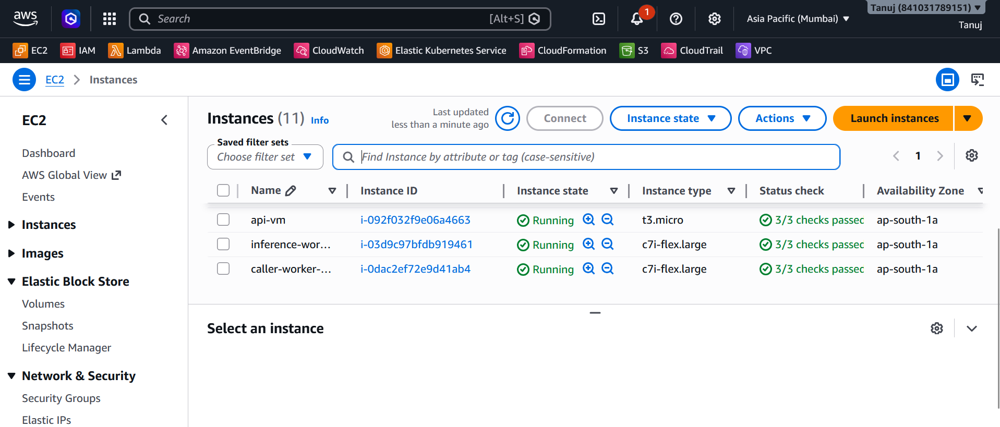
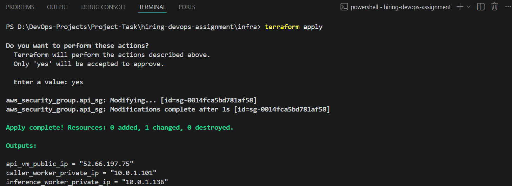
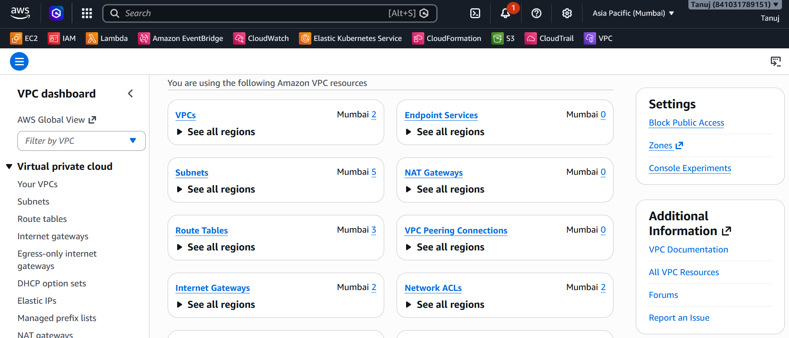
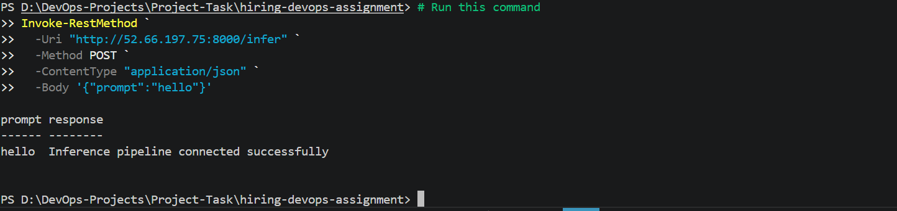

# DevOps Internship Assignment — Distributed Inference Architecture on AWS

## Overview

This project deploys a distributed worker-based inference architecture on AWS using Terraform. It exposes a public JSON API that routes inference requests through a private RPC chain of internal worker VMs, all isolated within a custom VPC.

---

## Architecture

```
         Internet
             |
             v
   +------------------+
   |   API Gateway    |
   |   Public VM      |
   |  52.66.197.75    |
   +------------------+
             |
      Internal VPC Traffic
             |
             v
   +------------------+
   |  caller-worker   |
   |  Internal VM     |
   |  10.0.1.101      |
   +------------------+
             |
       Internal RPC
             |
             v
   +--------------------+
   | inference-worker   |
   | Internal VM        |
   | 10.0.1.136         |
   +--------------------+
```

**Request Flow:**
1. Client sends `POST /infer` to the public API Gateway VM
2. API Gateway forwards the request internally to the **caller-worker** (Node.js/TypeScript)
3. caller-worker calls the **inference-worker** (Python/PyTorch) over private VPC networking
4. The inference result is returned back up the chain to the client

---

## Infrastructure Deployed

### EC2 Instances — All Running



> 3 instances provisioned: `api-vm`, `caller-worker`, `inference-worker` — all passing health checks in `ap-south-1a`

### Terraform Apply — Successful



> Infrastructure deployed with outputs:
> - `api_vm_public_ip = "52.66.197.75"`
> - `caller_worker_private_ip = "10.0.1.101"`
> - `inference_worker_private_ip = "10.0.1.136"`

### VPC & Network Configuration



> Custom VPC with 2 VPCs, 5 Subnets, 3 Route Tables, 2 Internet Gateways provisioned in Mumbai region

---

## API — Live & Working

### End-to-End Inference Response



> PowerShell `Invoke-RestMethod` hitting `http://52.66.197.75:8000/infer` with `{"prompt":"hello"}` returns successful inference response through the full RPC chain

---

## Repository Structure

```
infra/
├── provider.tf         # AWS provider + region config
├── network.tf          # VPC, subnets, routing
├── security.tf         # Security groups
├── compute.tf          # EC2 instance definitions
└── outputs.tf          # Public IP, private IPs

scripts/
├── setup-api.sh        # Bootstrap API Gateway VM
├── setup-caller.sh     # Bootstrap caller-worker VM
└── setup-inference.sh  # Bootstrap inference-worker VM

assets/
├── api-response.png    # Live API working screenshot
├── ec2-instances.png   # AWS EC2 console screenshot
├── terraform-apply.png # Terraform apply output
└── vpc-setup.png       # AWS VPC dashboard screenshot

README.md
.gitignore
```

---

## Deployment Instructions

### Prerequisites

- Terraform >= 1.3
- AWS CLI configured (`aws configure`) with sufficient IAM permissions
- An SSH key pair

```bash
aws configure
ssh-keygen -t rsa -b 4096 -f ~/.ssh/devops-key -N ""
```

### 1. Clone the Repository

```bash
git clone <repo-url>
cd <repo-directory>
```

### 2. Initialize Terraform

```bash
cd infra
terraform init
```

### 3. Validate Configuration

```bash
terraform validate
```

Expected output:
```
Success! The configuration is valid.
```

### 4. Deploy Infrastructure

```bash
terraform apply
```

Type `yes` when prompted.

Terraform will provision:
- VPC and subnets
- Security groups
- EC2 instances
- All networking configuration

Expected output:
```
Apply complete! Resources: X added, 0 changed, 0 destroyed.

Outputs:
api_vm_public_ip             = "52.66.197.75"
caller_worker_private_ip     = "10.0.1.101"
inference_worker_private_ip  = "10.0.1.136"
```

### 5. Run Worker Setup Scripts

SSH into each VM and run the corresponding setup script:

```bash
# On the API Gateway VM
bash scripts/setup-api.sh

# On the caller-worker VM (via API VM hop)
bash scripts/setup-caller.sh

# On the inference-worker VM
bash scripts/setup-inference.sh
```

### 6. Wait for Services to Start

```bash
# Wait 60 seconds for all services to initialize
sleep 60
```

---

## API Usage

### Endpoint

```
POST /infer
Host: 52.66.197.75:8000
Content-Type: application/json
```

### curl

```bash
curl -X POST http://52.66.197.75:8000/infer \
  -H "Content-Type: application/json" \
  -d '{"prompt":"hello"}'
```

### PowerShell

```powershell
Invoke-RestMethod `
  -Uri "http://52.66.197.75:8000/infer" `
  -Method POST `
  -ContentType "application/json" `
  -Body '{"prompt":"hello"}'
```

### Python

```python
import requests
response = requests.post(
    "http://52.66.197.75:8000/infer",
    json={"prompt": "hello"}
)
print(response.json())
```

### Sample Response

```json
{
  "prompt": "hello",
  "response": "Inference pipeline connected successfully"
}
```

---

## Worker Details

### caller-worker

| Property   | Value      |
|------------|------------|
| Private IP | 10.0.1.101 |
| Runtime    | Node.js    |
| Language   | TypeScript |
| SDK        | iii-sdk    |

Receives requests from the API Gateway and forwards them to the inference-worker via internal RPC.

### inference-worker

| Property   | Value                       |
|------------|-----------------------------|
| Private IP | 10.0.1.136                  |
| Runtime    | Python                      |
| Libraries  | Transformers, PyTorch (CPU) |

Runs the actual model inference and returns results upstream.

---

## Security Design

| Control | Implementation |
|---------|---------------|
| Public exposure | Only the API Gateway VM has a public IP |
| Worker isolation | Workers are in a private subnet with no public IP |
| Internal communication | All RPC traffic stays within the VPC on private IPs |
| SSH access | Restricted via security group rules |
| Internet access for workers | Not configured (no NAT Gateway in this MVP) |

---

## Debugging & Troubleshooting

### API not responding?

```bash
# SSH into API VM
ssh -i ~/.ssh/devops-key ec2-user@52.66.197.75

# Check service
systemctl status nodejs-api

# Check logs
journalctl -u nodejs-api -n 50
```

- Verify port `8000` is open in the API security group
- Confirm EC2 instance is in running state

### Worker connection issues?

```bash
# From API VM, hop to caller-worker
ssh ubuntu@10.0.1.101

# Check inference-worker reachability
curl http://10.0.1.136:<port>/health
```

### Terraform issues?

```bash
terraform validate
terraform plan
terraform refresh
```

- Ensure AWS credentials have EC2, VPC, and IAM permissions

---

## Cleanup

```bash
cd infra
terraform destroy
```

Type `yes` when prompted. Removes all EC2 instances, VPC resources, and security groups.

---

## Production Improvements

Before a production deployment, I would add:

**Security & Networking**
- HTTPS/TLS termination via ACM + ALB
- NAT Gateway for private worker outbound access
- IAM least-privilege policies
- Secrets Manager for credential management

**Reliability & Observability**
- Application Load Balancer with health checks
- Auto Scaling Groups
- CloudWatch logging, metrics, and alarms
- Worker supervision and auto-recovery

**Deployment & Operations**
- CI/CD pipeline (GitHub Actions / CodePipeline)
- Docker containerization
- ECS or Kubernetes orchestration

---

## Scaling Considerations

If the model size increases significantly (100x):

**Hardware**
- Switch to GPU-enabled EC2 instances (`g4dn.2xlarge`, `p3.8xlarge`)
- Use larger memory instances for model sharding

**Framework**
```python
# Use vLLM for 10-50x throughput improvement
from vllm import LLM
model = LLM("meta-llama/Llama-2-70b", tensor_parallel_size=4)

# Or 4-bit quantization to reduce memory footprint
model = AutoModelForCausalLM.from_pretrained(
    "model_name",
    load_in_4bit=True
)
```

**Architecture Changes**
- Deploy using **Kubernetes (EKS)** for orchestration and autoscaling
- Use optimized runtimes: **vLLM** or **Text Generation Inference (TGI)**
- Introduce **SQS queue-based** request handling
- Add **Redis caching** for repeated prompts
- Separate orchestration and inference layers for independent scaling

| Aspect | Current | Scaled |
|--------|---------|--------|
| Hardware | CPU t3.micro | GPU g4dn.2xlarge |
| Workers | 1 fixed | 2–20 auto-scaled |
| Framework | PyTorch | vLLM / TGI |
| Orchestration | EC2 + scripts | EKS / Kubernetes |
| Caching | None | Redis |
| Throughput | ~1 req/sec | 50+ req/sec |

---

## Notes

- CPU-only PyTorch wheels used intentionally to reduce image size and avoid CUDA dependencies
- Worker instances use `gp3` volumes sized for Python dependencies and model weight storage
- Internal worker communication validated through private VPC — no public internet path exists between workers
- Full infrastructure deployment and teardown reproducible via Terraform with no manual AWS console steps

---

## What's Working ✅

- ✅ Terraform deploys complete infrastructure end-to-end
- ✅ API Gateway publicly accessible on port `8000`
- ✅ Workers isolated in private subnet (zero public access)
- ✅ RPC communication working between caller and inference worker
- ✅ JSON API returns inference results successfully
- ✅ Security groups enforce strict network isolation
- ✅ All 3 EC2 instances passing health checks
- ✅ Full teardown with `terraform destroy`

---

**Maintainer:** Tanuj  
**AWS Account:** 841031789151  
**Region:** Asia Pacific — Mumbai (`ap-south-1`)  
**Submission:** 21st May 2026